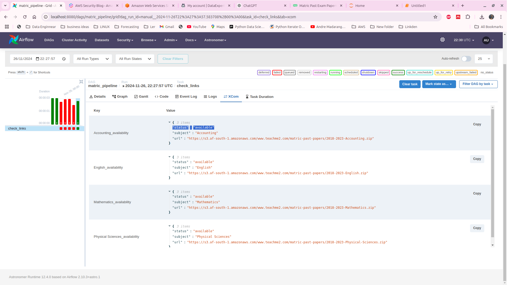

# matric exam papers data papiline: airlfow, aws glue, athena, apache spark


### Project Overview
In this project we build a data pipeline to process and analyze matric post-exam questions. Using modern data engineering tools and technologies such as Airflow, AWS Glue, Lambda Functions, and Athena, the pipeline extracts, transforms, and loads the question data into a structured format. The pipeline ensures data quality, allows efficient querying, and facilitates actionable insights for education authorities, curriculum developers, and students.


### Source
The data used for the current project is extracted from the **Teach Me 2** platform where we have available matric past exams papers for various subjects. for the current project we will the exam papers for subjects such as Mathematics, Physical Sciences, Accounting, and English, spanning the years 2018 to 2023. 

- [Mathematics](https://s3.af-south-1.amazonaws.com/www.teachme2.com/matric-past-papers/2018-2023-Mathematics.zip)  
- [Physical Sciences](https://s3.af-south-1.amazonaws.com/www.teachme2.com/matric-past-papers/2018-2023-Physical-Sciences.zip)  
- [Accounting](https://s3.af-south-1.amazonaws.com/www.teachme2.com/matric-past-papers/2018-2023-Accounting.zip)  
- [English](https://s3.af-south-1.amazonaws.com/www.teachme2.com/matric-past-papers/2018-2023-English.zip)


### Stack
* AWS S3 - for storage 
* AWS Glue crawler- for data cathalog 
* AWS glue job- for data transformation
* AWS Athena - for data processing
* Apache airflow - for orchestration


### Steps

**Requirements**

must have docker running

1. Setup Airflow environment


```
# create project directory
mkdir matric-past-exam-papers
cd matric-past-exam-papers


astro dev init 

#start airflow
astro dev start

# to restart airflow
astro dev restart
or 


#to stop airflow
astro dev stop


```
you can access airflow **http://localhost:8080**


1. Check if the links are available





2. Get files - implemented through a Pythonoperator with callable get_files.

3. Load files to s3 bucket


3. Create lambda function to extract files from the zip folder and store in s3 bucket

4. Create lambda function to extract from pdf to json file

5. Run Glue Crawler

6. Create a glue job to transform the json file into parquet


7. query data using Athena


8. create odbc to connect to aws Athena 


9. run analytics using power bi, 


